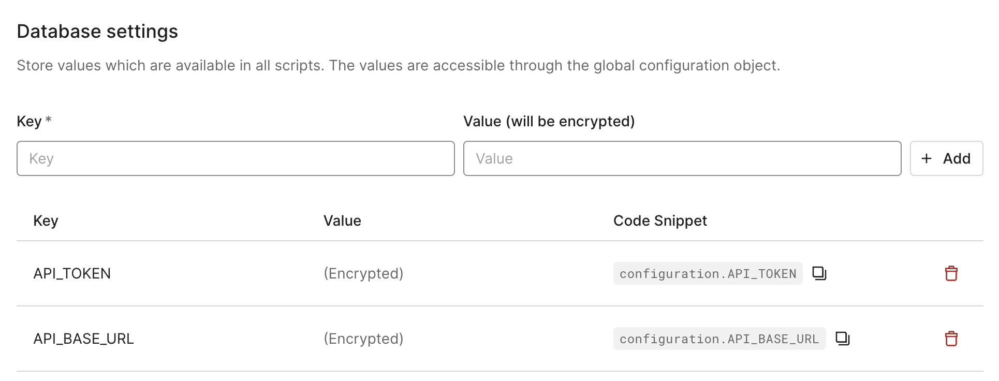

# Auth0 Custom Database Worker

A Cloudflare Worker that receives webhook requests from Auth0 custom-db and persists user entities in a D1 SQLite database.

## Features

- Receives Auth0 custom-db webhooks on the `/find`, `/create`, `/login` and `/delete` endpoints
- Logs incoming webhook data
- Uses D1 SQLite database for data persistence
- Built with TypeScript for type safety
- Uses Hono framework for routing and request handling

## Setup

### Prerequisites

- [Node.js](https://nodejs.org/) (v14 or later)
- [Wrangler CLI](https://developers.cloudflare.com/workers/wrangler/get-started/) (Cloudflare Workers CLI)

### Installation

1. Clone this repository
2. Install dependencies:

```bash
npm install
```

3. Create a D1 database using Wrangler:

```bash
wrangler d1 create auth0_users
```

4. Update the `wrangler.toml` file with your database ID from the previous step. When you create the database, Wrangler will output something like:

```
✅ Successfully created DB 'auth0_users' in region LOCATION_NAME
Created your new D1 database.

[[d1_databases]]
binding = "DB"
database_name = "auth0_users"
database_id = "12345678-1234-1234-1234-123456789abc"
```

Copy the UUID (e.g., `12345678-1234-1234-1234-123456789abc`) and replace the `database_id` value in `wrangler.toml`.

5. Create the users table in your D1 database:

```bash
wrangler d1 execute auth0_users --remote --command "DROP TABLE users"
wrangler d1 execute auth0_users --remote --command "CREATE TABLE users (
  user_id INTEGER PRIMARY KEY AUTOINCREMENT,
  email TEXT,
  created_at TIMESTAMP DEFAULT CURRENT_TIMESTAMP
)"
```

6. Create an API_TOKEN to secure connection between Auth0 and your worker:

```bash
export API_TOKEN=`openssl rand -hex 32`
echo "API_TOKEN=$API_TOKEN" > .env
echo $API_TOKEN

wrangler secret put API_TOKEN
```
Add API_TOKEN and worker's 

### Development

To run the worker locally:

```bash
npm run dev # using npm
make dev    # using make
```

### Deployment

To deploy the worker to Cloudflare:

```bash
npm run deploy  # using npm
make deploy     # using make
```

### Building

To build the project:

```bash
npm run build # using npm
make build    # using make
```

## Usage

Send POST requests with JSON payloads to the `/find/email/` endpoint. The worker will log the received data and respond with a success message.

Example:

```bash
curl -X GET "https://auth0-customdb.<your-subdomain>.workers.dev/find/email/me@there.com" \
  -H "Content-Type: application/json" \
  -H "Authorization: Bearer ${API_TOKEN}" 
```

To monitor the log:

```bash
wrangler tail
```

Access the database from command line:

```bash
wrangler d1 execute auth0_users --remote --command "SELECT * FROM users"
```

## Auth0 Setup

Add `API_TOKEN` and `API_BASE_URL` to Auth0 custom-db settings:



## Project Structure

- `src/index.ts` - Main worker code
- `wrangler.toml` - Cloudflare Worker configuration
- `package.json` - Project dependencies and scripts
- `tsconfig.json` - TypeScript configuration
- `webpack.config.js` - Webpack bundling configuration
- `Makefile` - Build and deployment automation
